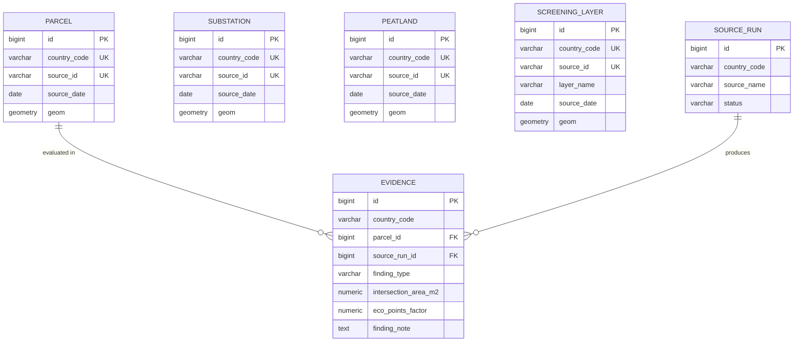

# Architecture & Design Decisions - Project IRIS

This document outlines the core technical decisions, architectural patterns, and database engineering principles applied in Project IRIS.

## 1. Two-Schema ELT Architecture
The database utilizes an ELT (Extract, Load, Transform) pattern split across two distinct schemas to ensure data integrity without breaking ingest pipelines:
* **`iris_staging` (The Landing Zone)**: Accepts raw, messy data from external government and grid operators. Columns are loosely typed (e.g., `TEXT` for dates, unconstrained `GEOMETRY`) so that unexpected incoming data formats do not cause immediate pipeline crashes.
* **`iris_core` (The Canonical Model)**: The production schema. It enforces strict spatial types (`MultiPolygon`/`Point`), standardizes date formats, locks coordinates to SRID `4326` (WGS84), and enforces `NOT NULL` requirements. 

The Python script (`etl.py`) acts as the transformation layer, pulling from staging, applying business logic (e.g., standardizing UK vs. German date formats), and safely inserting into core.

## 2. Idempotency & Conflict Resolution
To survive automated orchestration (like Apache Airflow or Cron), the ELT pipeline is designed to be 100% idempotent—running it once or 1,000 times yields the exact same database state.
* **Compound Unique Keys**: Every core table enforces uniqueness via a natural compound key: `UNIQUE (country_code, source_id)`.
* **source_id semantics**: `source_id` is the upstream row identifier as delivered by the source (e.g. `PARCEL-GB-01`); provenance to the source dataset is carried by `evidence` and `source_run`.
* **Upsert Logic**: The Python pipeline utilizes PostgreSQL's `ON CONFLICT (country_code, source_id) DO UPDATE` to safely update spatial geometries and metadata if a pipeline reruns, preventing duplicate data accumulation.
* **Sequence Management**: Seed scripts dynamically recalculate `setval` identity sequences to prevent auto-increment collisions during testing and resets.

## 3. Strict Spatial Constraints
To prevent downstream analytical errors, PostGIS constraints are enforced at the database level rather than just the application layer:
* **Geometry Targeting**: Land and environmental zones are strictly locked to `MultiPolygon` to account for fragmented parcels, while electrical substations are locked to `Point`. 
* **SRID Locking**: All geometries are explicitly constrained to `4326` (WGS84) at the column level to prevent mixed-projection data corruption. Attempting to insert unprojected or incorrectly projected data results in a database-level rejection.

## 4. Indexing Strategy
To optimize spatial queries over complex polygons alongside relational filtering, the database separates indexing strategies:
* **GiST (Generalized Search Tree)** indexes are applied to all `geom` columns to accelerate bounding-box calculations for operations like `ST_Intersects` and `ST_DWithin`.
* **B-Tree** indexes are applied to the `country_code` columns and all foreign keys (e.g., inside the `evidence` junction table) to accelerate relational joins and regional filtering.

## 5. Geographic vs. Geometric Accuracy
By default, PostGIS calculates `ST_Distance` and `ST_Area` in the unit of the spatial reference system (which, for 4326, is Cartesian degrees). To calculate the 1,000m grid proximity and the exact square meter overlap of the peatlands, the verification queries cast the geometries to `::geography`. 

This forces PostGIS to perform calculations over the curvature of the Earth, yielding highly accurate, real-world metric measurements (meters/square meters) across different European latitudes without projection distortion.

## 6. Schema Diagram (Core)

## 7. Deliberate Simplifications & Production Evolution
To satisfy the timeboxed constraints of the pilot, the following simplifications were made:
1. **Pipeline Orchestration:** The ELT process is executed via a manual Python script (`etl.py`). For production, this logic would be wrapped in an orchestrator (e.g., Apache Airflow or Dagster) to manage dependencies, scheduling, and automated `source_run` logging.
2. **Evidence Generation:** Evidence records are currently verified manually via SQL (`verify_queries.sql`). In production, a dedicated spatial screening service would automatically execute these PostGIS intersections and write the results back to the `evidence` table after the core ingestion phase completes.
3. **Secrets Management:** The database connection URI is currently hardcoded to streamline the local pilot evaluation. Production deployments would strictly prohibit hardcoded credentials, requiring integration with environment variables and a secure secrets manager (e.g., AWS Secrets Manager or HashiCorp Vault).